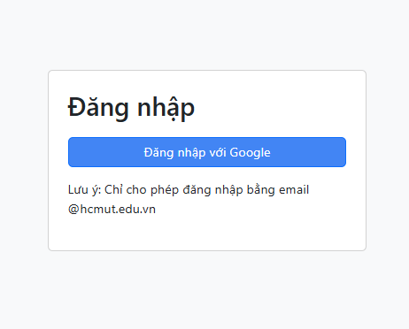
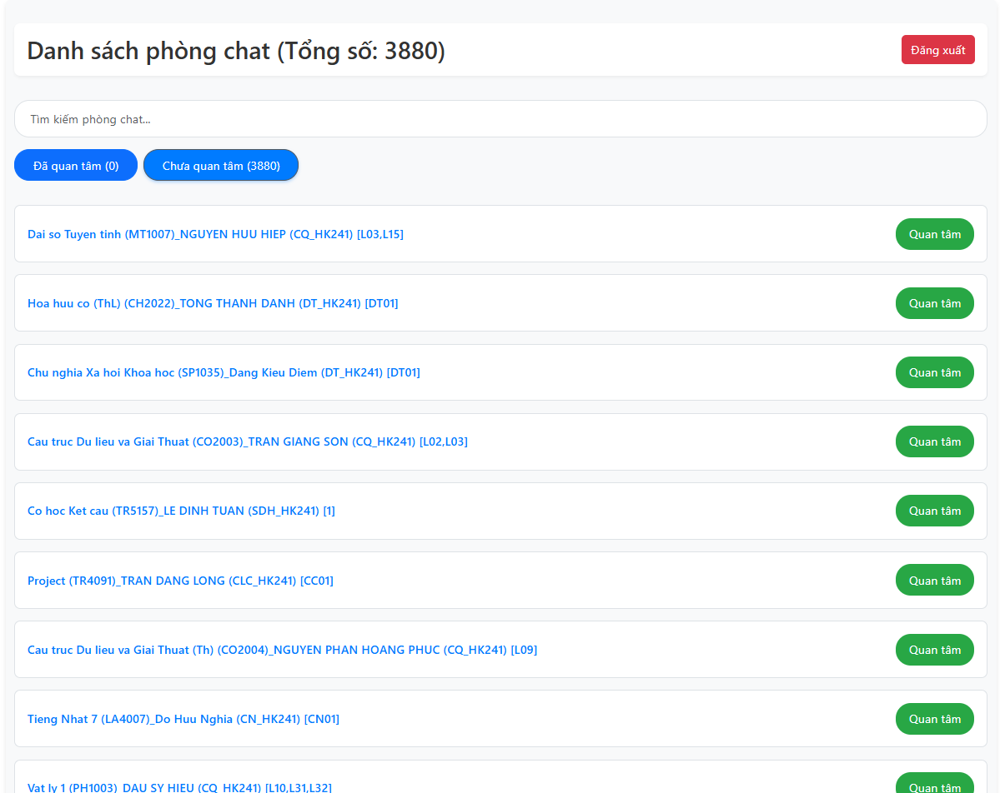
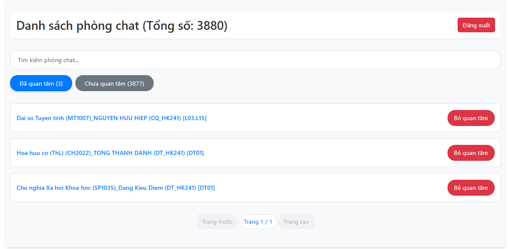
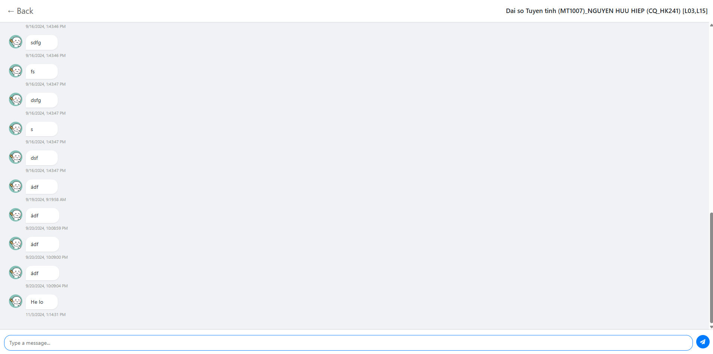

# HCMUT Chat Application

A real-time chat application built with React and SupaBase, designed for students at Ho Chi Minh City University of Technology (HCMUT) to communicate effortlessly in various chat rooms.

[Live Demo](https://hcmut-chat-app.vercel.app/login)

## 📱 Preview

*Include screenshots here to showcase key features:*

### Login Screen


### Chat Room List



### Message Input Interface


## 🚀 Features

- **Authentication**: Secure login for HCMUT students.
- **Real-time Chat**: Instant message updates powered by Firebase.
- **Multiple Chat Rooms**: Create and join different chat rooms for focused discussions.
- **Responsive Design**: Optimized for seamless use on both desktop and mobile devices.

## 🛠️ Technologies Used

- **React.js**: Frontend framework for building interactive UIs.
- **SupaBase**: Realtime Database & Authentication.
- **SCSS**: For organized, responsive styling.
- **Context API**: State management across the application.

## 🏗️ Project Structure

```
src/
├── components/           # React components
│   ├── ChatRoom/         # Components related to chat rooms
│   ├── Login/            # Authentication components
│   └── RoomList/         # Chat room list components
├── contexts/             # Context API for global state
├── hooks/                # Custom React hooks
└── App.js                # Main application component
```

## ⚙️ Installation

1. **Clone the repository**:
   ```bash
   git clone https://github.com/phihung0131/HCMUT-Chat-App
   ```

2. **Install dependencies**:
   ```bash
   npm install
   ```

4. **Start the development server**:
   ```bash
   npm start
   ```

## 🔄 Available Scripts

- `npm start`: Runs the app in development mode.
- `npm test`: Launches the test runner.
- `npm run build`: Builds the app for production.


